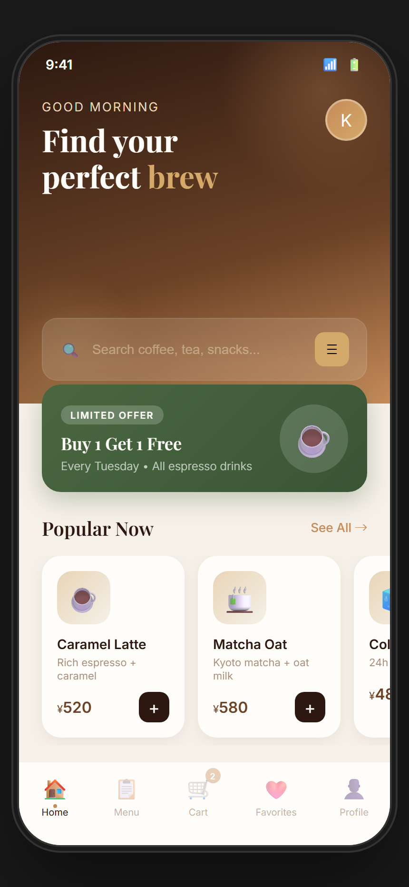
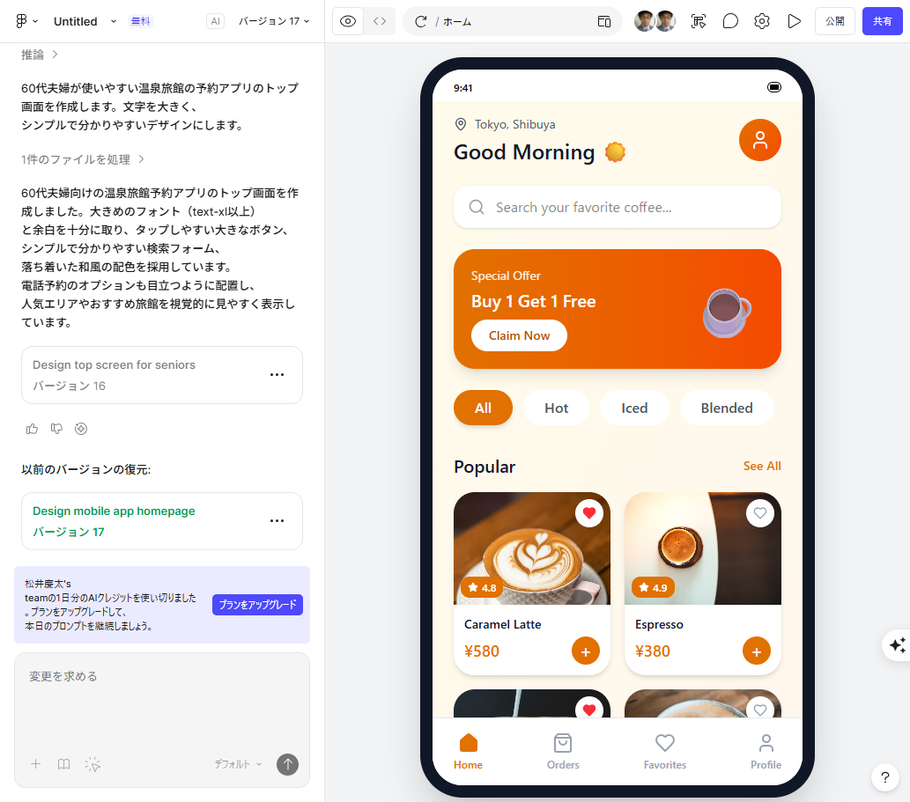

# Experiment 01: コーヒーショップのモバイルアプリのトップ画面

## お題
「コーヒーショップのモバイルアプリのトップ画面」（テキストのみ、指示なし）

## 結果

### Claude の出力
- [HTML/CSS](claude_output.html)
- 

### Figma の出力
- 

## 比較

| 項目 | Figma | Claude | 判定 |
|:---|:---|:---|:---|
| 商品画像 | リアルなコーヒー写真 | 絵文字 | **Figma** |
| カテゴリフィルター | All/Hot/Iced/Blended | なし | **Figma** |
| 星評価・お気に入り | あり（4.8, 4.9, ハート） | なし | **Figma** |
| 色使い | オレンジ系、明るく元気 | ブラウン系、落ち着き | 好み |
| タイポグラフィ | シンプル | Playfair Display使用 | 互角 |
| 情報量 | 多い、実用的 | 少ない | **Figma** |

## 発見

- Claudeはデザインの「見た目」（色、タイポグラフィ、グラデーション）に偏り、機能設計を軽視する傾向がある
- カテゴリフィルター、星評価、お気に入りボタンなど「使い勝手」に直結する要素が抜けていた
- 画像の扱いが最大の課題。Figmaはリアルな写真を配置できるが、ClaudeはHTML出力のため絵文字に逃げた
